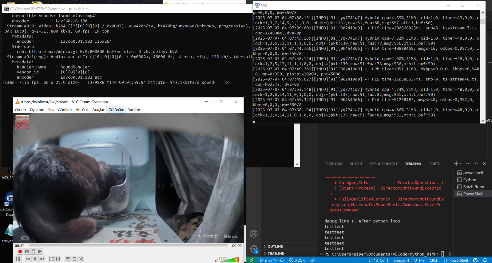

# RTMP-FFMPEG
## Description
- This project was given as a recruitment task. The project case can be explained as:
> Build an RTMP based, local host stream platform. Any available RTMP server can be used. Publisher client must use an FFMPEG for streaming. Also derive a system-service to launch the entire program at once. Stream must have an random overlay image, which will be handled with requests library, using python.

## Technical
- Program is designed to work for Windows systems. 


## Explanation
- **overlay.py** downloads a 160x160 bit image from picsum.photos
- **publisher.bat** is the client with ffmpeg script, loops the video and and overlay image
- **launch.ps1** launches the system on a single terminal screen.

## Instructions
- Clone this repo
- Download and build the available [SRS](https://github.com/ossrs/srs) release here
- backup and then edit the **srs.conf** file located in "(x86)...\SRS\conf\srs.conf" as:
```
    listen              1935;
    max_connections     1000;
    daemon              off;
    srs_log_tank        console;

    vhost __defaultVhost__ {
        dvr {
            enabled     off;
    }
        hls {
            enabled         on;
            hls_path        ./objs/nginx/html;
            hls_fragment    5;
            hls_window      20;
        }
    }
```

- Then launch SRS with admin privileges. Add an exclusion to firewall for port 1935 (it used to be flash player port, so sometimes firewalls block it)
- Run **launch.ps1** with powershell
- Open VLC or OBS or similar, select network capture and listen to localhost as: **rtmp://localhost/live/stream**

## Overview


## Possible Future Implementations
- Streamer client and RTMP server build
- GUI adaptation
- Linux support
